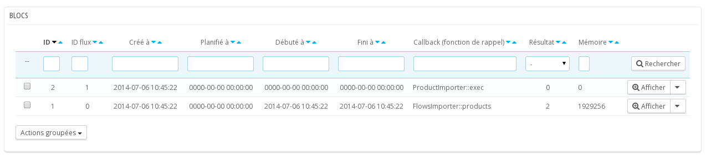
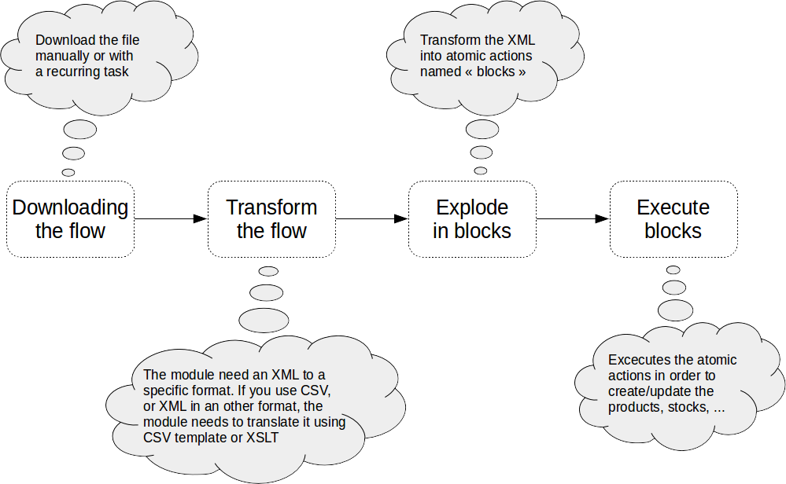

## 1. Installation

To install the module, it is necessary to use the PrestaShop interface created for this purpose: In the back office under the tab "module", click on “Add a new module”.

A form appears:


Choose the zip archive of the module then click on the button: "Change the module"

A message will inform you that the module is downloaded. 

To search the modules, search "importer" then click on the button “install”.


In the menu, a new entry will appear: 


The module is now installed. We just need to activate it now.

## 2. Activate the Smart Cron

The smart cron simulate an unix cron. It allows to execute tasks each minutes.

**The activation can only be done from your processing environment.**

If you have a preprocessing  environment, you can access from an external environment, contact us with the PrestaShop Addons form.

The module will works in a degraded mode from a local environment. This mode is sufficient to carry out tests but recurring tasks cannot be done. 

To activate the module go to "Configuration" in the menu. Fill in the field “Order Reference” with the order number and active the api “smart cron”.


## 3. Import a basic flow

We will use the following flow:

```
<products>
    <product external-reference="demo-1">
        <name>Name</name>
        <description>Product description</description>
        <price>20</price>
    </product>
</products>
```

The importation from the back office will be done via the tab PrestaShop XML Importer > Upload


Copy the flow on a file edited with an editor like notepad and upload it via the form.


If you have not activated the module (in case you have done tests on a local machine for instance), it is necessary to simulate the normal operating mode.

To do this, type the url here under in your web browser: [http://localhost/prestashop/modules/advancedimporter/cron.php?debug](http://localhost/prestashop/modules/advancedimporter/cron.php?debug)

"localhost" and “prestashop” of the url have to be adapted to your configuration. [http://localhost/prestashop/](http://localhost/prestashop/) is the url of your shop’s home page. 

The flow now figures in the list under the tab PrestaShop XML Importer > Flow.

In PrestaShop XML Importer > Blocks, two new lines appear:



The block #2 is now pending execution (result = 0). It will be executed automatically if you have activated the module. 

Otherwise, it will be necessary to execute it manually. To do so, choose (in the combobox on the right) the option "Execute the block" (icon play) :


The product is now imported.

## 4. Understand how the module works

The module do multiple actions in order to download, translate in its own language, explode the flow into atomic actions, and finally create the objects (products, stock movements, ...).
This schema explain how these actions succeeded each other :



In the previous example we downloaded the flow manually. The module did not transform the flow as it was already in the native format. After that the flow was exploded in block. The block was executed and the product was created.
