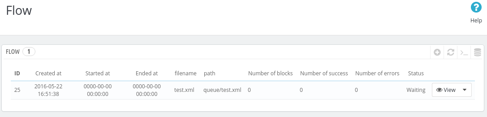
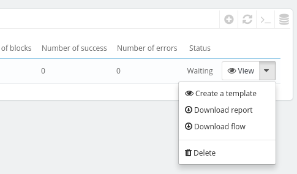
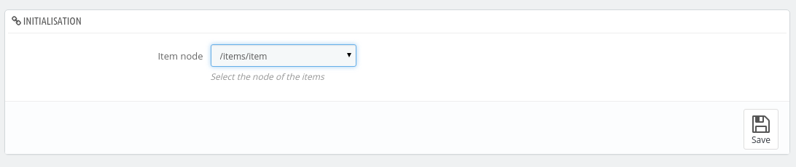
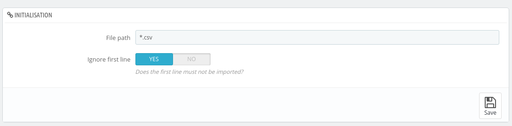
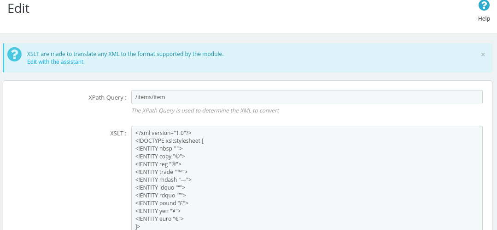

By default the module only support XML files of the format defined in this documentation.

If you get your XML flows from a supplier or if you want to use CSV flows, you have to make a "**template**".

A **template** translate CSV or XML flows into the format supported by PrestaShop XML & CSV Importer.

## Create a template

After [importing your flow](Import_Flows), you must see something like that:

To create a template, select nito the actions, the option "**Create a template**":

If you try to create a template for an XML, the assistant will ask you to define the **xpath** of the items. In other words, the path to the node of the products:

If you try to create a template for a CSV, the assistant will ask you to define the **filepath** of the file name. Set *.csv if you don't know. This filepath, is a mask. This mask will be use to apply the template to your CSV files:

For the others steps, follow the instructions on the screen.

## Edit a template

To edit a template created from CSV file, go into the entry "XML template" from the menu.

To edit a template created from XML file, go into the entry "XML template" from the menu.

Click on the template you want to edit:

Here, click the link "Edit with the assistant" in the blue area.

