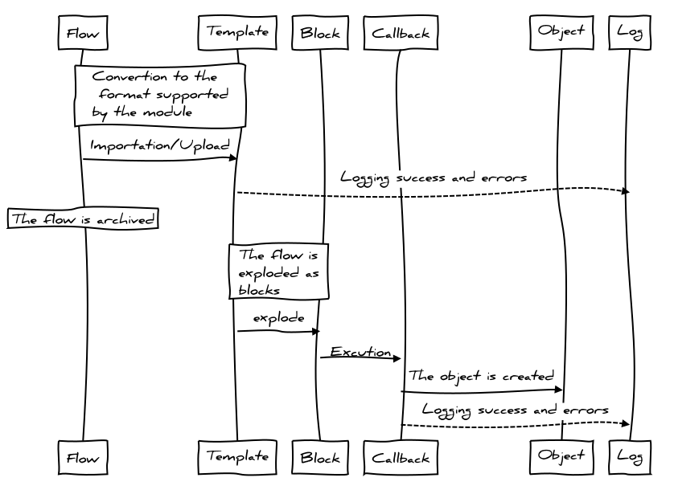

PrestaShop XML & CSV Importer est un module d'import dimentionné pour les flux de taille importante.
Il est capable de gérer des flux de plusieurs centaines de Mo.

Le module sait importer toutes les entités de PrestaShop (classes PHP héritant de ObjectModel).

Comme le nom du module le suggère il est possible d'importer des XML, des CSV, mais aussi de fichiers plats type mqseries (en cour de développement).

Pour ce qui est des fichiers de tableurs (Excel, Libre Office, ...), il doivent être préalablement convertit en CSV.

## Tâche planifiée

## Principe de base de l'import d'un flux

Entre l'importation du flux et l'import effectif de ce dernier il y a de nombreuses étapes.

On distingue plusieurs grandes étapes :
1. Téléchargement du fichier de flux
2. Conversion du fichier de flux dans le format compréhensible par le module
3. Lecture du flux et enregistrement en multiple « blocs »
4. Conversion des blocs en entités PrestaShop

Les deux premières étapes demande des actions de configurations. Les deux autres, sont autonomes et ne demande pas de configuration.

### Téléchargement du fichier de flux

Le téléchargement du flux n'est pas abordé en détail ici, vous pouvez trouver plus d'information dans la section [Importer un flux].

Il existe 3 façons de télécharger un flux :
- manuellement, en utilisant un formulaire dédié
- depuis une URL,  via une tâche planifiée
- depuis un serveur FTP,  via une tâche planifiée

Pour ce qui connaissent le fonctionnement des ETL, le module s'en inspire grandement. Un modèle est en fait l'**extracteur**. Son rôle est de convertir le flux en format entités (block). L'exécution des blocs se charge de **transformer** l'entité en entité PrestaShop et de la **charger** en base de donnée.

Voici un schéma résumant la vie d'une flux. Ce schéma peut sembler complexe mais avec quelques explications il est plus facile de le comprendre

On note que le flux (flow) est premièrement importer au moyen d'un modèle (template). Ce modèle permet de convertir le fux dans en langage comprehensible pour le module. Après cela, au moyen du template, le flux est découpé en blocs (blocks). Chaque bloc correspond à une entité (un produit par exemple). Ensuite, les blocs sont exécuté un à un afin des créer les entités (object).

Pour ce qui connaissent le fonctionnement des ETL, le module s'en inspire grandement. Un modèle est en fait l'**extracteur**. Son rôle est de convertir le flux en format entités (block). L'exécution des blocs se charge de **transformer** l'entité en entité PrestaShop et de la **charger** en base de donnée.

Chaque action peut ajouter des informations dans les logs afin de suivre les étapes et de comprendre les éventuels problèmes.

Le traitement des flux n'est pas un traietement monotâche. Afin de supporter des flux important le flux est traité en plusieur fois. Ainsi, on limite les risques de dépassement mémoire, ou de limite de temps d'exécution.

## Organisation de la documentation

Dans l'intégralité de cette documentation, il sera concidéré que vous avez créé un modèle permettant de traiter votre flux dans le format du fournisseur. Seul l'article [Importer un flux](importer un flux) détaille l'import de flux au format fournisseur. L'ensemble des exemples de flux seront donc ceux supportés par le module est ne nécéssitant par de modèle.

## Fonctionnalités

Le module permet :
- de créer des produits dans spécifiquement une ou plusieurs boutiques
- d'enregistrer en multilangue
- d'importer tout type d'entités PrestaShop (produits, categories, clients, stocks, images, commandes, ...)
- de créer des produits complexes (déclinaisons, packs, ...)
- de ne pas mettre à jour ou mettre à jour partiellement un produit si ce dernier existe déjà
- de limiter les imports à la mise à jour
