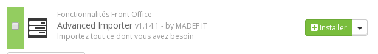
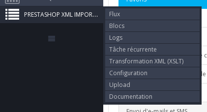
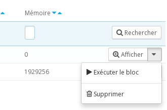

## 1. Installation

Pour installer le module, il faut utiliser l’interface de PrestaShop prévue à cet effet : depuis le back office dans l’onglet "module", cliquez sur “Ajouter un nouveau module”.

Un formulaire apparait :


Choisissez l’archive zip du module puis cliquez sur le bouton "Charger le module".

Un message vous informe que le module est téléchargé.

Dans la recherche des modules recherchez "importer" puis cliquez sur le bouton “installer”.



Dans le menu une nouvelle entrée fait son apparition :



Le module est maintenant installé. Il nous reste plus qu’à l’activer.

## 2. Activer le Smart Cron

Le smart cron simule le cron unix, ce dernier permet d'exécuter des tâches toutes les minutes.

**L’activation ne peut être faite que depuis votre environnement de production.**

Si vous avez un environnement de préproduction accessible depuis l’extérieur contactez-nous via le formulaire de PrestaShop Addons.

Depuis un environnement local, le module fonctionnera en mode dégradé. Ce mode est suffisant pour faire des tests mais ne permet pas d’effectuer des tâches récurrentes.

Pour activer le module aller dans "Configuration" du menu plus haut. Renseigner le champ “Référence de commande” avec le numéro de votre commande et activez l’api “smart cron”.


## 3. Importer un premier flux

Nous allos utiliser le flux suivant :

```
<products>
    <product external-reference="demo-1">
        <name>Nom</name>
        <description>Description du produit</description>
        <price>20</price>
    </product>
</products>
```

L’importation du backoffice se fait via l’onglet PrestaShop XML Importer > Upload


Copier le flux dans un fichier à l'aide d'éditeur comme "bloc note" et téléchargez le via le formulaire :


Si vous n’avez pas activé le module (dans le cas où vous faites des tests sur une machine locale par exemple), il faut simuler le fonctionnement normal.

Pour cela entrez dans votre navigateur l’url suivante : [http://localhost/prestashop/modules/advancedimporter/cron.php?debug](http://localhost/prestashop/modules/advancedimporter/cron.php?debug)

"localhost" et “prestashop” de l’url sont à adapter en fonction de votre configuration. [http://localhost/prestashop/](http://localhost/prestashop/) étant l’url de la page d’accueil de votre boutique.

Le flux est maintenant listé dans l’onglet PrestaShop XML Importer > Flux.

Dans PrestaShop XML Importer > Blocs, deux nouvelles lignes sont apparues :


Le bloc #2 est maintenant en attente d’exécution (resultat = 0). Il sera exécuté automatiquement si vous avez activé le module.

Dans le cas contraire, il faudra l’exécuter manuellement. Pour cela, choisissez dans les actions (liste déroulante à droite) l’option "Exécuter le bloc" (icone play) :



Le produit est maintenant importé.

## 4. Comprendre le fonctionnement du module

Le module effectue plusieurs actions pour télécharger, traduire dans une langue qu'il comprend, séparer le flux en actions atomiques, et enfin, créer les objets (produits, mouvement de stocks, ...).
Ce schéma explique comment les actions se succèdent :


Dans le précédent exemple, le flux a été téléchargé manuellement. Le module n'a pas eu besoin de le traduire car il était dnas le langage natif. Après quoi, le flux a été "séparé" en un bloc. Le bloc a été exécuté et le produit a été créé.
