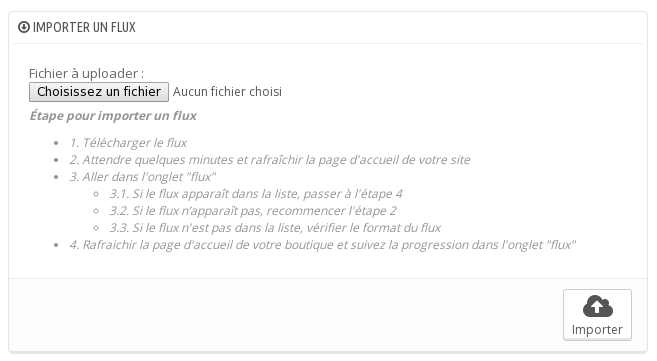

## Installation

L'installation du module s'effectue de manière standard :
- via l'interface addons
- depuis le panel d'administration

L'installation par FTP est possible, mais n'est pas recommandée à cause des problèmes de droits qui peuvent se produire.

Nous ne détaillerons pas l'installation depuis addons.

Pour installer le module à partir de l'archive, rendez-vous dans l'onglet « module » depuis le panel d'administration.

Cliquez sur le bouton « ajouter » (bouton « + »), un formulaire devrait apparaitre :

Choisissez l’archive zip du module puis cliquez sur le bouton « Charger le module ».

Un message vous informe que le module est téléchargé.

Dans la recherche des modules, recherchez « importer » puis cliquez sur le bouton « installer ».

Dans le menu une nouvelle entrée fait son apparition :

Le module est maintenant installé. Il ne vous reste plus qu’à l’activer.

## Activer le Smart Cron

Le smart cron simule le cron unix, ce dernier permet d'exécuter des tâches toutes les minutes.

**L’activation ne peut être faite que depuis votre environnement de production.**

Si vous avez un environnement de préproduction accessible depuis l’extérieur contactez-nous via [le formulaire de PrestaShop Addons](https://addons.prestashop.com/fr/contactez-nous?id_product=7951).

Depuis un environnement local, le module fonctionnera en mode dégradé. Ce mode est suffisant pour faire des tests mais ne permet pas d’effectuer des tâches récurrentes.

Pour activer le module allez dans "Configuration" du menu plus haut, renseignez le champ « Référence de commande » avec le numéro de votre commande et activez l’api « smart cron ».

## Tester le bon fonctionnement du module

Téléchargez le flux [suivant](!flow/check-install.xml)

L’importation du backoffice se fait via l’onglet « PrestaShop XML Importer » > « Flux ». Ici cliquez sur le bouton « + » « Ajouter ».

Téléchargez le flux via le formulaire :

Après quelques minutes un nouveau produit devrait être présent.

Si vous n'avez pas activé le smartcron, alors il faudra rafraichir à plusieurs reprise la page « Flux » depuis votre interface d'administration.

Si le produit n'est pas créé, contactez [notre support](https://addons.prestashop.com/fr/contactez-nous?id_product=7951).
