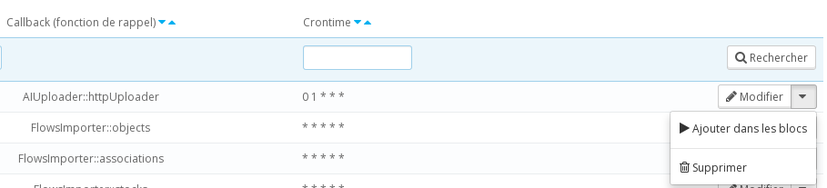

The importation of flows can be done three different ways:

* Via the administration panel 
* Via FTP or SSH
* Via a planned task

In the different examples whatever the chosen method, we will use the following flow:

```
<products>
	<product external-reference="demo-1">
		<name>Name</name>
		<description >Product description</description>
		<price>20</price>
	</product>
</products>
```

## Importing a flow via the back office

The importation of the back office will be done via the tab PrestaShop XML Importer > Upload


Copy the flow on a file edited with an editor like notepad and upload it via the form.


If you have not activated the module (in case you have done tests on a local machine for instance, it is necessary to simulate the normal operating mode.


The flow now figures in the list under the tab PrestaShop XML Importer > Flow.

## Importation via FTP or SSH

It is possible to place the flow on the server directly by placing them in the file queue of the module (/modules/advancedimporter/flows/import/queue/).

So test it with the sample file.

If your module has been activated, wait a few minutes, the flow now figures in the list under the tab PrestaShop XML Importer > Flow.


The flow is now listed under the tab PrestaShop XML Importer > Flow.


## Importation via a planned task

PrestaShop XML Importer is able to manage planned tasks. 

To do this, go to the tab PrestaShop XML Importer > recurring task.

This screenshot lists all the recurring tasks as well as the flow processing tasks.

This is where can be added one or several importers. 

Click on the button, "Add an importer". 

In the form, fill in the following fields:

* Description : Test importer
* Cron Time : 0 1 * * *
* Url : http://prestashopxmlimporter.madef.fr/example/product01.xml
* Filename : filename_%date%.xml or filename_%date%.csv
* Station : 1
* Id shop : 1

The notion of station will not be detailed in this documentation. Please always put the number "1".

The field "cron time", uses the same syntax as the software cron. You may find [more details on wikipedia](http://fr.wikipedia.org/wiki/Crontab#Syntaxe_de_la_table).

In this example, the flow is set to be imported daily at 1 am.

Save the recurring task. 

The flow will be imported at 1 am. To check that this works, it is possible to force things. 

In the new line of the recurring tasks, choose the option "add in the blocks" (the icon “play”).



Go in the block list: PrestaShop XML Importer > Blocs.

This screenshot lists all the plannified tasks.

Our importer figures in the first line of the list. We can cheat even more by choosing the option "Execute the block". If you have activated the module, this action is not necessary.

Another line appears in the lists of the blocks. If it is executed the same way as before, the product will be imported (this action is not necessary if the module has not been activated). 


