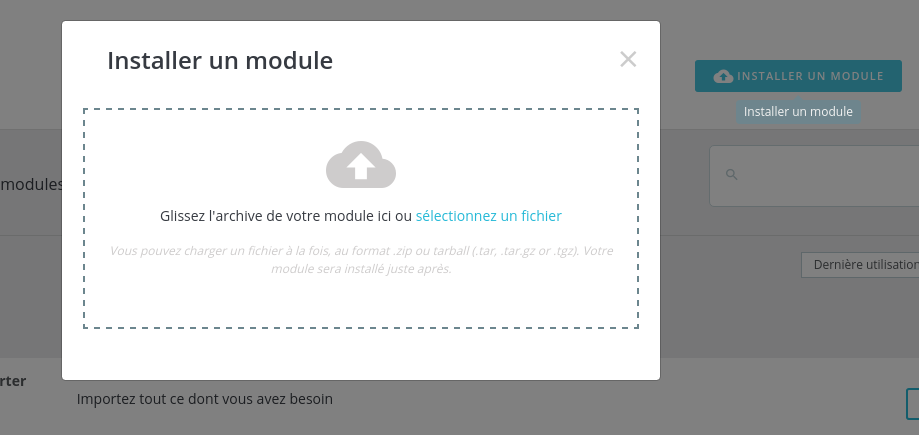
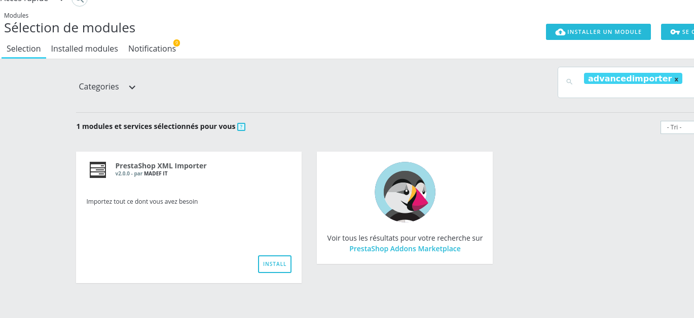
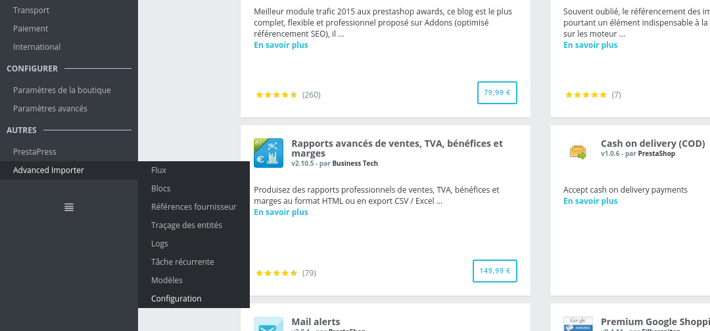
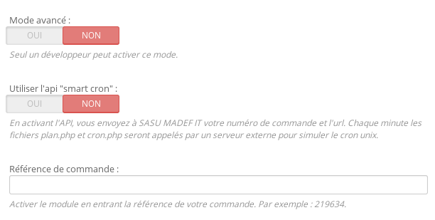
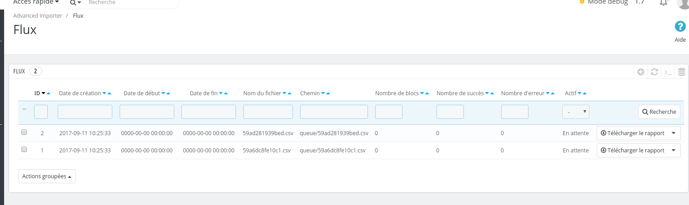
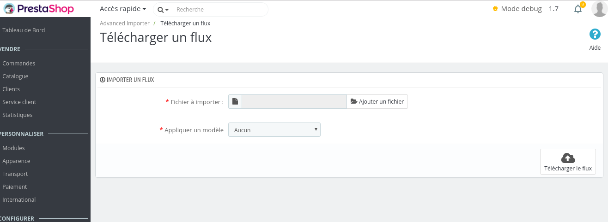

## Installation

Install the module using the standard methods:
- Through the addons interface
- From the administration panel

It can also be installed through FTP, but this is not recommended due to the permissions problems that may result. 

Installation through the addons interface will not be covered by this documentation. 

To install the module from the archive, go to the “module” tab in the administration panel. 
Click on the “add” button (“+”), a form should appear:

Choose the module zip archive, then click on the “Load module” button.

A message will appear to inform you that the module has been downloaded.

In the module list, look for the “import” option, then click on the “install” button. 

A near entry will appear in the menu:

The module is now installed. Now it simply needs to be activated through the module configuration. 

## Activating Smart Cron

Smart cron simulates unix cron, which allows tasks to be executed every minute. 

**The module can only be activated through your production environment.**

If you have a preproduction environment that is accessible externally, contact us through [the PrestaShop Addons form](https://addons.prestashop.com/fr/contactez-nous?id_product=7951).

The module will run in restricted mode when run through a local environment. This mode is sufficient for running tests but does not allow recurring tasks to be executed. 

To activate the module, go to “Configuration” in the menu, fill in the “Order reference” field with your order number, and activate the “Smart cron” API.  

## Testing the module

Download this [feed](!flow/check-install.xml)

The backoffice is imported through the “Advanced Importer” > “Feed” tab. Then click on the “+” “Add” button.  

Download the feed using the form:

After several minutes a new product should be visible. 

If you haven’t yet activated Smart cron, you will then need to refresh the “Feed” page several times through your administration panel. 

If the product hasn’t been created, contact [our support team](https://addons.prestashop.com/fr/contactez-nous?id_product=7951).
