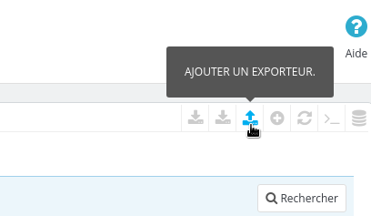
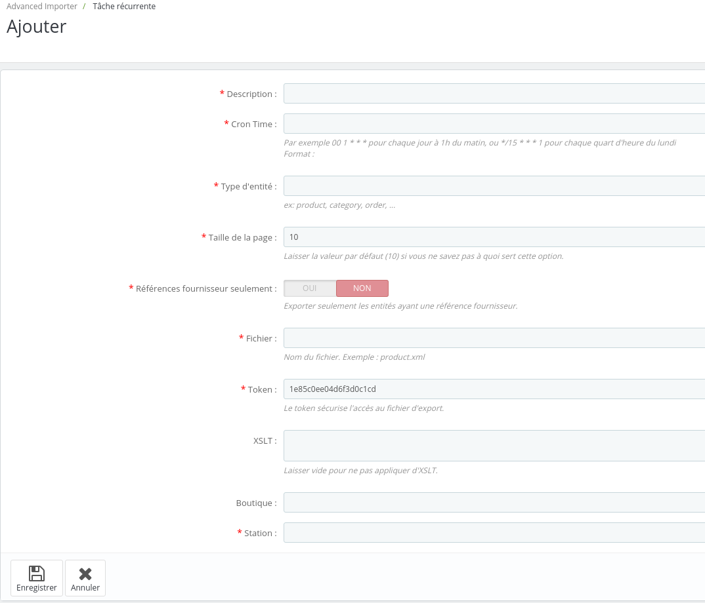

The module allows the export of all entities. For example, it is possible to export all products in the catalog. In addition to this, it allows to export all entities related to the products (ex: categories, tags, declensions, specific prices, ...).

Thanks to the data export, you can for example synchronize the stock between two PrestaShop. You can also send your orders to another application.

## Export Strategies
Several export strategies exist:
- complete: the entire catalog or orders
- partial: all the entities modified or created since the last export (this option is not yet possible)

These strategies make it possible to export either the complete catalog, the stock differences, the new orders or the change in order statuses.

## Format of exported flows
The export flows are in XML format as described in the documentation (some specificities exist but the exported stream can be imported by the module).
It is possible to customize feeds with XSLT. So you can transform the XML export feeds into CSV or flat files according to your needs.

## Reference supplier
When entities have a vendor reference, the module uses them instead of ids. This can only be done if the entities have been imported by the module.

## Security
Export files are protected by a single token for each file.

## First export
To create a new export go to the backoffice> Advanced Importer> Recurring task.
Here in the list of possible options (top right) choose the icon "Add an exporter".

You arrive on the following form:

Fill in the different options and save the form. A confirmation message will be displayed with the url of the feed.

Be careful, the feed will not be available immediately. The url should redirect you to a 404 error. You must first execute the task and wait for the flow to be generated.
