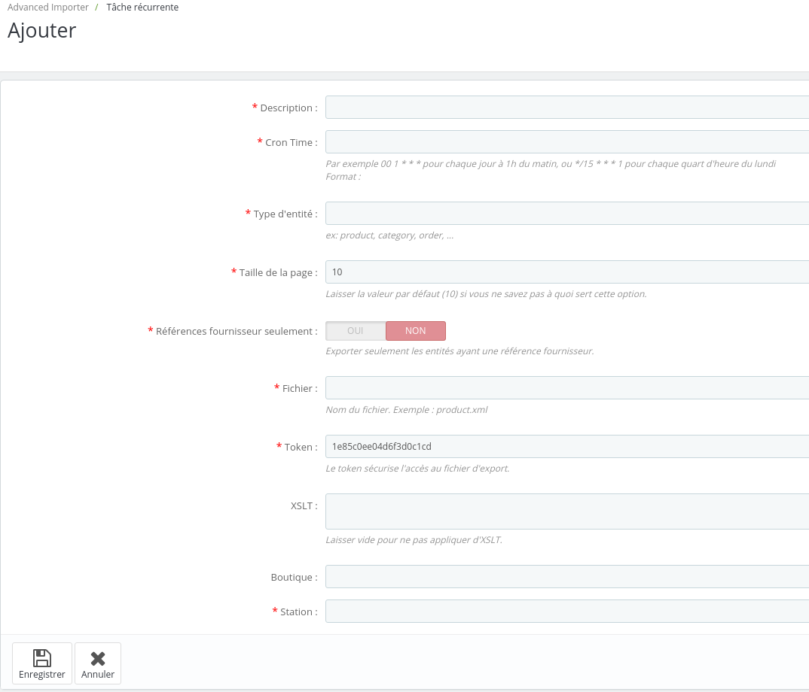
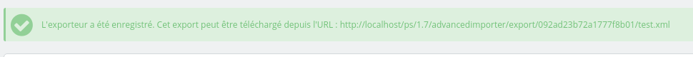

Le module permet l'export de toutes entités. Par exemple, il est possible d'exporter l'ensemble des produits du catalogue. En plus de cela, il permet d'exporter toutes entités liées aux produits (ex : categories, tags, déclinaisons, prix specifiques, ...).

Grâce à l'export de données, vous pouvez par exemple synchroniser le stock entre deux PrestaShop. Vous pouvez aussi envoyer vos commandes à une autre application.

## Stratégies d'export
Plusieurs stratégies d'exportation existent :
- complète : l'intégralité du catalogue ou des commandes
- partielle : l'ensemble des entités modifiées ou créées depuis le dernier export (cette option n'est pas encore possible)

Ces stratégies permettent d'exporter soit le catalogue complet, soit les différences de stocks, soit les nouvelles commandes ou encore les changement des statuts des commandes.

## Format des flux exportés

Les flux d'export sont au format XML comme décrit dans la docummentation (certaines spécifités existent mais le flux exportés peuvent être importés par le module).
Il est possible de personnaliser les flux grâce à des XSLT. Vous pouvez donc transformer les flux d'export XML en CSV ou en fichiers plat selon vos besoins.

## Référence fournisseur

Lorsque les entités ont une référence fournisseur, le module utilise ces dernières à la place des ids. Cela ne peut être fait que si les entités ont été importées par le module.

## Sécurité

Les fichiers exports sont protégés par un token unique pour chacun des fichiers.

## Premier export

Pour créér un nouvel export rendez-vous dans le backoffice > Advanced Importer > Tâche récurrente.
Ici dans la liste des options possible (en haut à droite) choisissez l'icone « Ajouter une exporteur ».

Vous arrivz sur le formulaire suivant :

Remplissez les différentes options et enregistrez le formulaire. Un message de confirmation sera affiché avec l'url du flux.

Attention, le flux ne sera pas disponible immédiatement. L'url devrait vous rediriger sur une une erreur 404. Il faut dans un premier temps exécuter la tâche et attendre que le flux soit généré.
